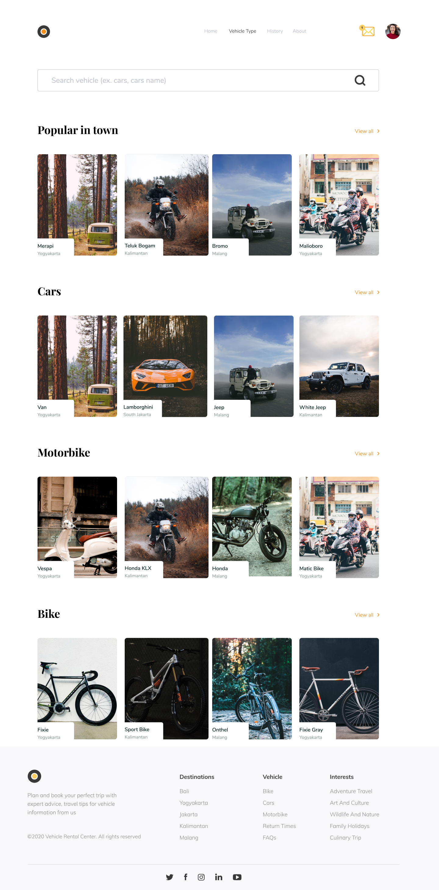
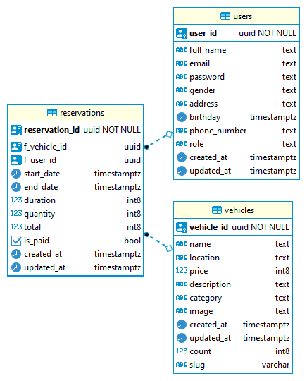

# Vehicle Rental

Vehicle Rental is a two-sided marketplace app for renting vehicles. The primary feature is consumers can rent vehicles while renters can offer their vehicles for rent. This Restful API was built using Golang and PostgeSQL, GORM for ORM, and dependency injection as modularization. Finally deploy it with Docker.

## 🔥 Showcase

- [Web Client Repository](https://github.com/rfauzi44/vehicle-rental-web)
- Web Screenshot

- Database Schema

- [Docker Image](https://hub.docker.com/r/rfauzi/vehicle-rental-backend)
- [Postman Docs](https://documenter.getpostman.com/view/25042327/2s93JtQPPz)

## ⚡ Feature

- CRUD for all modules
- GORM Query
- Authentication and Authorization
- Sorting, Filtering, Searching
- Database Migration

## 💻 Built with

- [Gorilla MUX](https://github.com/gorilla/mux) for handling HTTP requests and responses
- [GORM](https://github.com/go-gorm/gorm) for ORM library
- [JWT](https://github.com/golang-jwt/jwt) for authentication and authorization
- [Postgres](https://github.com/postgres/postgres) for DBMS
- [Sendinblue](https://github.com/sendinblue/APIv3-go-library) for sending emails
- [Docker](https://github.com/docker) for deployment
